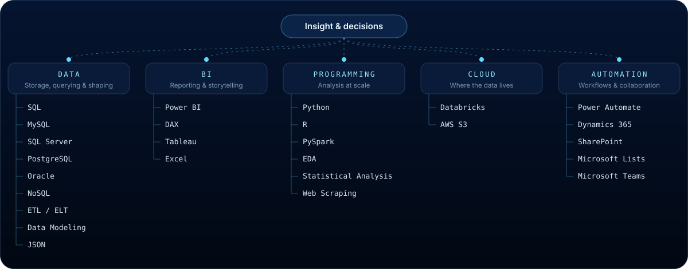

  

  

  <b>I turn raw, messy data into decisions.</b> 
  Business Intelligence Analyst at <b>Navy Federal Credit Union</b>, building the dashboards, 
  KPI reporting and root-cause analysis that help teams see what is happening and why — 
  and, outside of work, designing and shipping my own products.

 

## ◆ Now

<table>
  <tr>
    <td width="36%" valign="top">
      CURRENT ROLE 
      <b>Business Intelligence Analyst</b> 
      Navy Federal Credit Union 
      Vienna, Virginia · November 2025 — Present
    </td>
    <td valign="top">
      <b>Collect</b> — gather and aggregate structured and unstructured data 
      <b>Analyse</b> — find trends and patterns, run root-cause analysis, forecast costs, risks and profits 
      <b>Visualise</b> — build and maintain advanced reports, BI dashboards and KPI reporting 
      <b>Decide</b> — translate requirements into reporting specs and communicate insights to stakeholders
    </td>
  </tr>
</table>

## ◆ Journey

| Role | Organisation | When |
| --- | --- | --- |
| **Business Intelligence Analyst** | **Navy Federal Credit Union** · Vienna, VA | Nov 2025 — Present |
| Data Analyst | Capital One · McLean, VA | Mar 2022 — Nov 2025 |
| Data Analyst | Sagence, Inc. · Chicago, IL | Mar 2021 — Feb 2022 |
| Graduate Teaching Assistant | George Mason University | May 2019 — Jan 2021 |
| Machine Learning Engineer (Internship) | Token Metrics · Washington, D.C. | May 2020 — Jul 2020 |
| Data Analyst | Satvat Infosol Pvt Ltd · India | Feb 2016 — Sep 2018 |

EDUCATION — Master's degree, Data Analytics · George Mason University (2019 — 2020) &nbsp;·&nbsp; Bachelor of Engineering, Computer Science · Anna University

## ◆ Technology ecosystem

  

## ◆ Selected work

  

**[TuneKadal](https://tunekadal.com/)** — a Tamil radio app and website I designed and built. 244+ Tamil radio stations with station discovery, favourites, lock-screen / background playback, an AI station guide and multiple ocean-inspired visual themes. Built with React Native and Expo, available on Android and iOS · [tunekadal.com](https://tunekadal.com/) · [App Store](https://apps.apple.com/app/id6773931613)

**[Interactive 3D portfolio](https://shinojjerald.github.io/ShinojJerald/)** — this repository. An "underwater data observatory" built with React, TypeScript and Three.js: custom GLSL shaders, scroll-driven camera, device-aware rendering, reduced-motion support and a full no-WebGL fallback. Source in [`/portfolio`](./portfolio).

## ◆ Project universe

| Project | Type | |
| --- | --- | --- |
| [Sentiment Analysis on COVID-19 using Twitter Tweets](https://github.com/ShinojJerald/Sentiment-Analysis-on-COVID-19-using-Twitter-Tweets) | NLP | Repo |
| [Image Recognition and Captioning using Computer Vision and NLP](https://github.com/ShinojJerald/Image-Captioning-Computer-Vision-and-NLP-) | Computer vision · NLP | Repo |
| Heart Disease Prediction using Classification and ANN | Machine learning | [Classification](https://github.com/ShinojJerald/Heart-Disease-Prediction) · [ANN](https://github.com/ShinojJerald/Artificial-Neural-Networks) |
| [Hospitality Business Price Predictions using Regression](https://github.com/ShinojJerald/The-hospitality-business-Price-Prediction.) | Machine learning | Repo |
| [New York Crime Rate in the Year 2014](https://github.com/ShinojJerald/New-York-Crime-Visualization) | Visualisation | Repo |
| Sales Agent Analytics | Analytics | |
| Shipping Analytics — Northwind | Analytics | |
| HR Analytical Report | Analytics · Reporting | |

More in the lab: <a href="https://github.com/ShinojJerald/Model-Selection">Model Selection</a> · <a href="https://github.com/ShinojJerald/Classification-models">Classification</a> · <a href="https://github.com/ShinojJerald/Regression-Models">Regression</a> · <a href="https://github.com/ShinojJerald/Clustering-Algorithms">Clustering</a> · <a href="https://github.com/ShinojJerald/Deep-Learning">Deep Learning</a> · <a href="https://github.com/ShinojJerald/Reinforcement-Learning">Reinforcement Learning</a> · <a href="https://github.com/ShinojJerald/Dimensionality-reduction--PCA">PCA</a> · <a href="https://github.com/ShinojJerald/Dimensionality-Reduction--LDA">LDA</a> · <a href="https://github.com/ShinojJerald/Eliza-Chatbot">ELIZA chatbot</a>

## ◆ Credentials

<table>
  <tr>
    <td valign="top" width="50%">
      IBM 
      Advanced Data Science Specialist 
      Advanced Data Science with IBM 
      Applied AI with DeepLearning 
      Advanced Machine Learning and Signal Processing 
      Fundamentals of Scalable Data Science
    </td>
    <td valign="top">
      SUPERDATASCIENCE · UDEMY · START-TECH ACADEMY · HACKERRANK · FREECODECAMP 
      Machine Learning A-Z: Hands-On Python &amp; R in Data Science 
      Master Tableau for Data Science · Face Recognition AI Using Python 
      SQL Masterclass: SQL for Data Analytics 
      Time Series Analysis and Forecasting using Python 
      SQL Badge · Responsive Web Design
    </td>
  </tr>
</table>

## ◆ Find me

  <a href="https://shinojjerald.github.io/ShinojJerald/"><b>3D Portfolio</b></a> &nbsp;·&nbsp;
  <a href="https://github.com/ShinojJerald"><b>GitHub</b></a> &nbsp;·&nbsp;
  <a href="https://www.linkedin.com/in/shinoj-kumar-2a1670176"><b>LinkedIn</b></a> &nbsp;·&nbsp;
  <a href="https://tunekadal.com/"><b>TuneKadal</b></a>

Everything on this page is drawn with hand-made SVG — no third-party badges or stat widgets.
